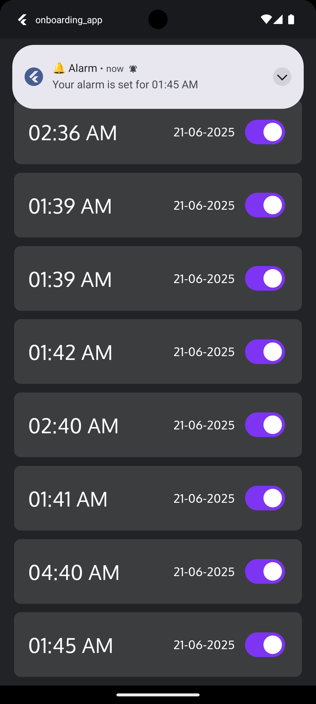
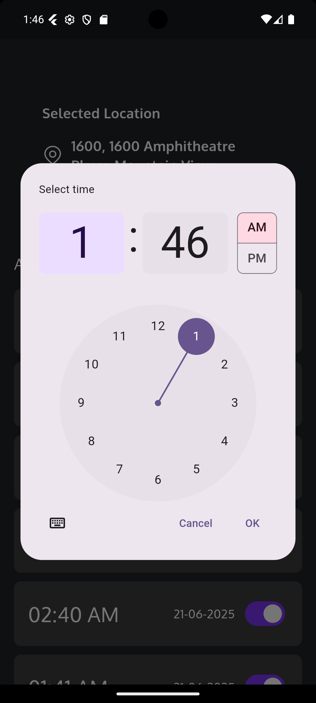
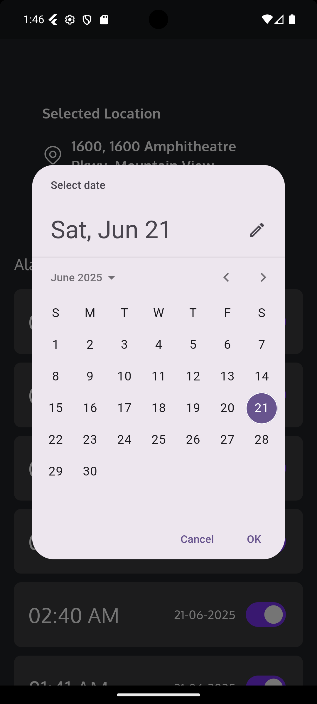
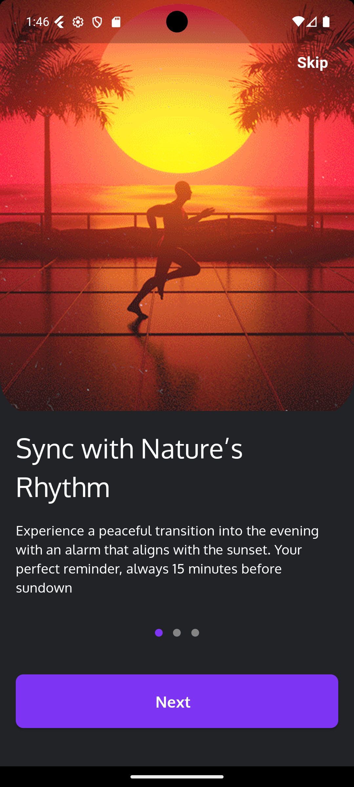
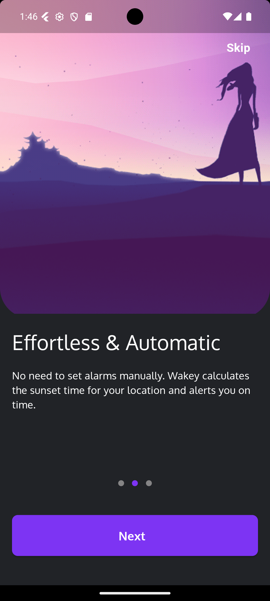
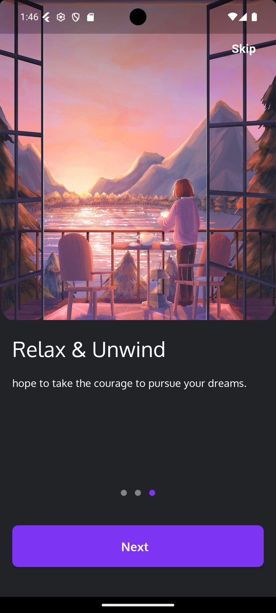
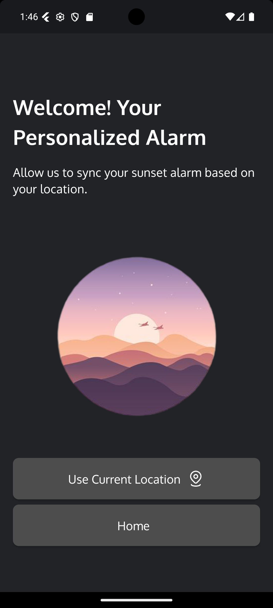

## Getting Started
# 🛠️ Onboarding App (Flutter)

A simple and elegant onboarding app built using Flutter.  
This app guides the user through an onboarding experience, asks for location permission, and allows the user to set alarms with local notifications.

---

## 🚀 Features

- ✅ Beautiful onboarding screens (3 screens based on Figma design)
- 📍 Request and display current location
- ⏰ Set alarms with custom time
- 🔔 Local notifications when alarm goes off
- 💾 Optional: Persist alarms locally using local storage
- 📱 Responsive UI for all screen sizes

---

## 📸 Screenshots (Optional but recommended)

> Add screenshots here using `` if possible.

🧰 **Packages Used**

flutter_local_notifications =>	For showing local notifications
location and geocoding =>	To get user’s current location
intl =>	For date and time formatting
shared_preferences =>	To optionally save alarms locally
permission_handler => To request location permissions
flutter_screenutil => For making the UI responsive across different screen sizes and densities
google_fonts => customizable fonts from Google Fonts in this app
dots_indicator => 	To show dot indicators (e.g., in onboarding or tutorial screens)
timezone => To manage and schedule time-based tasks or notifications across time zones

**project screenShort**

## Home Screen

## Onboarding Screen

## Welcome Screen

